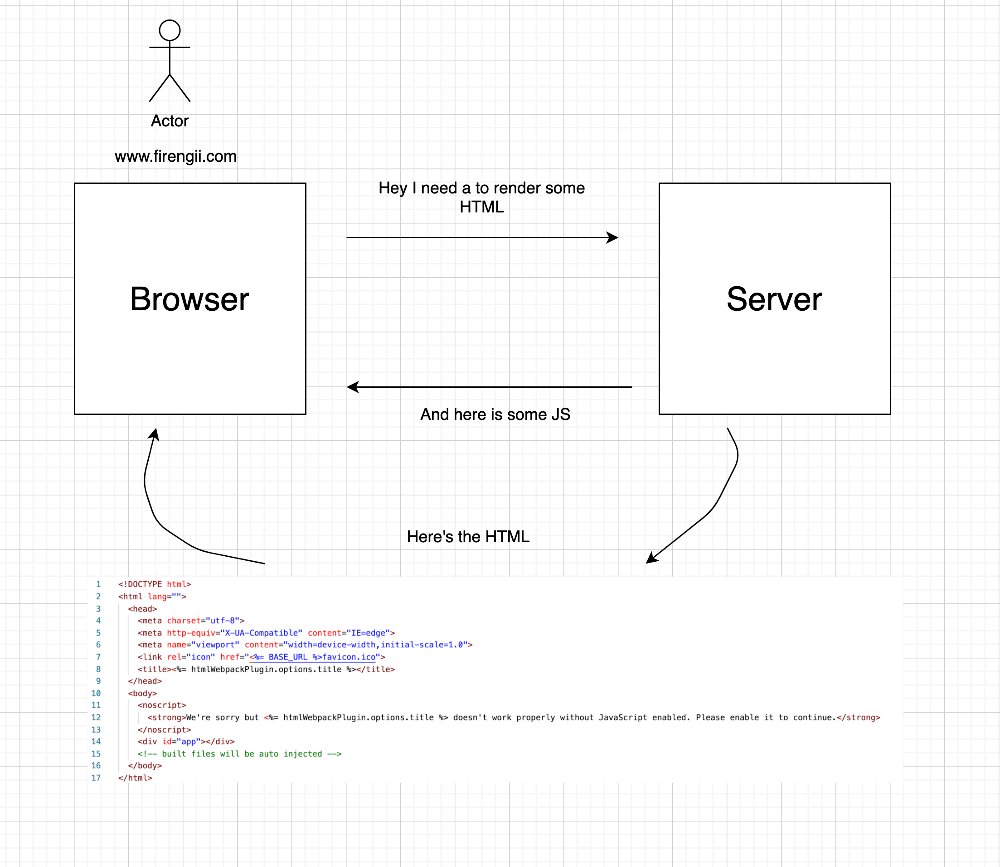

# What is Nuxt?

Nuxt is a frontend JavaScript framework that is built on top of **Vue.js**, which itself is another JavaScript framework. Because of this, Nuxt is known as a higher level framework.

A framework is a toolset allows you to build your application by providing you with tools and guidelines. It also allows for easy ways to accomplish repetitive tasks.

For instance, listening and responding to a click event is a very common thing most websites do.

In plain **Vanilla JS**, accomplishing this would look something like this:

```javascript
    let button = document.getElementById("celebrate-btn");

    button.document.addEventListener("click", () => {
        alert("Celebration time come on!")
    })
```

Whereas in a framework like **Vue**, accomplishing the same thing would look something like this:

```html
    <button @click="alert('Celebration time come on!')">
```

Eventually this gets transpiled back **Vanilla JS**, but for development purposes, the approach is far easier to use.

Just like Vue is a framworks built of JavaScript, Nuxt is a framework built on top of Vue.

Thus is provides additional utlities and functionalities on top of the Vue js framework.

Here is a list of things that Nuxt provides on top of Vue:

### 1) Provides us with an easy way of creating universal web apps

To explain this, let's explore how Vue renders our application to the browser.

1) Once you go to a specific domain, the browser makes a request to the web server asking for HTML files to render

2) The Vue web server HTML file with some basic boilerplate and all the application's JS files

3) The browser initially renders this HTML file and then parses the JS files.

4) The JS contains the instructions that eventually create new HTML and eventually gets rendered to the DOM

<br />

<br />
<br />

This is known as **client-side rendering**, because we are creating and rendering our HTML elements in the client (browser) rather than the server.

There's a few advantages to this approach.

For instance, it

- Reduces the load on the server
- Allows for static files to be cached
- Gives a more mobile app feel

However, there are also some notable drawbacks.

- Web crawlers crawl the empty HTML feel, which is bad for SEO
- Heavy JS dependency
- Slow Render

- Everything is rendered via the JS, and web engines dont wait da

Preloads app on server which improves SEO